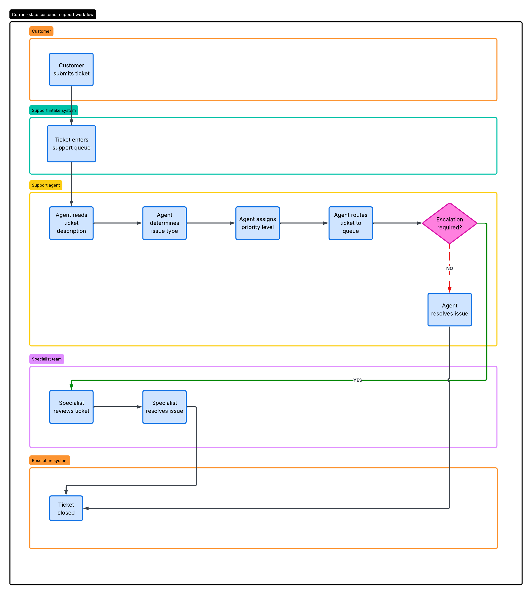
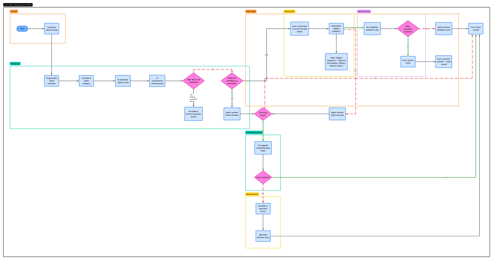

# Customer Support AI Optimization

> Analyzing support ticket data and designing AI-assisted triage workflows to reduce friction, cut resolution times, and improve customer experience.

---

## Table of Contents

1. [Problem Statement](#1-problem-statement)
2. [Solution Overview](#2-solution-overview)
3. [Dataset](#3-dataset)
4. [Repository Structure](#4-repository-structure)
5. [Notebooks](#5-notebooks)
6. [Workflow Design](#6-workflow-design)
7. [Key Findings](#7-key-findings)
8. [AI Triage Validation](#8-ai-triage-validation)
9. [Results & Business Impact](#9-results--business-impact)
10. [Tech Stack](#10-tech-stack)
11. [Setup](#11-setup)

---

## 0. Executive Summary

https://abdulrahman080.github.io/customer-support-ai-optimization/

## 1. Problem Statement

Customer support teams operating at scale face consistent operational friction: agents spend significant time reading long ticket descriptions, manually assigning urgency levels, and routing cases to the correct queues. This process is inconsistent, slow under high ticket volumes, and difficult to audit.

This project investigates how data analysis and AI-assisted triage can reduce that friction across the full support lifecycle — from initial ticket intake through to resolution.

---

## 2. Solution Overview

The project combines operational analytics with a Gemini-powered triage prototype to:

- Identify where delay and dissatisfaction concentrate across ticket types and support channels
- Quantify customer effort using a composite scoring model
- Evaluate AI-assisted ticket summarization, classification, and routing
- Redesign the current-state support workflow into a hybrid AI + human future-state model

---

## 3. Dataset

**Source:** `data/raw/customer_support_tickets.csv`  
**Size:** 8,469 tickets × 17 columns

| Field | Description |
|---|---|
| `Ticket ID` | Unique ticket identifier |
| `Customer Name / Email / Age / Gender` | Customer demographics |
| `Product Purchased` | Product associated with the ticket |
| `Date of Purchase` | Purchase date |
| `Ticket Type` | Refund request, Technical issue, Billing inquiry, Cancellation request, Product inquiry |
| `Ticket Subject` | Short subject line |
| `Ticket Description` | Full issue description |
| `Ticket Status` | Open / Closed / Pending Customer Response |
| `Resolution` | Agent resolution notes |
| `Ticket Priority` | Low / Medium / High / Critical |
| `Ticket Channel` | Email, Phone, Chat, Social media |
| `First Response Time` | Timestamp of first agent response |
| `Time to Resolution` | Timestamp of resolution |
| `Customer Satisfaction Rating` | Post-resolution satisfaction score |

**Ticket distribution:** Roughly balanced across all five ticket types (~1,630–1,750 per type) and all four support channels (~2,070–2,140 per channel).

---

## 4. Repository Structure

```
customer-support-ai-optimization/
│
├── data/
│   ├── raw/
│   │   └── customer_support_tickets.csv       # Original dataset (8,469 tickets)
│   └── processed/
│       └── cleaned_tickets.xls                # Cleaned and feature-engineered dataset
│
├── notebooks/
│   ├── 1_data_cleaning.ipynb                  # Data cleaning and feature engineering
│   ├── 2_eda_dashboard.ipynb                  # KPI dashboard and EDA
│   ├── 3_friction_analysis.ipynb              # Friction scoring and bottleneck analysis
│   └── 4_AI_Workflow_Optimization_&_Validation_with_Gemini_API.ipynb  # Gemini triage prototype
│
├── docs/
│   ├── findings.md                            # Full analytical findings and recommendations
│   └── workflow_design.md                     # Channel-based AI automation strategy
│
├── visuals/
│   ├── CurrentStateCustomerSupportWorkflow.png
│   └── FutureStateAIAssistedSupportWorkflow.png
│
└── README.md
│
└── index.html
```

---

## 5. Notebooks

### `1_data_cleaning.ipynb` — Data Cleaning & Feature Engineering

Loads the raw CSV, standardises column names, and engineers the features used throughout the analysis:

- **Datetime parsing** for `date_of_purchase`, `first_response_time`, and `time_to_resolution`
- **`resolution_time_hours`** — hours between first response and resolution (negative values removed)
- **`response_delay_hours`** — hours between purchase and first response
- **`is_delayed`** — flag for tickets exceeding the 75th percentile resolution time
- **`customer_effort_score`** — composite score combining resolution time and delay flag
- **`high_effort`** — flag for tickets exceeding the 75th percentile effort score
- **`priority_score`** — numeric encoding of ticket priority (Low=1 → Critical=4)
- **`description_length` / `resolution_length`** — text length features
- **`ticket_type_grouped`** — consolidates low-frequency ticket types into "Other"

Output saved to `data/processed/cleaned_tickets.xls`.

---

### `2_eda_dashboard.ipynb` — KPI Dashboard & EDA

Produces a full operational dashboard across the cleaned dataset, including:

- **KPI summary** — total tickets analysed, average and median resolution time, average response delay, delay rate, average satisfaction, high-effort rate
- **Resolution time distributions** — histogram with KDE for resolution time and response delay
- **Ticket type breakdowns** — resolution time, delay rate, and satisfaction by ticket type
- **Correlation heatmap** — across numeric features including effort score, satisfaction, and priority
- **Channel performance** — resolution time and satisfaction by support channel
- **Priority analysis** — resolution time distribution across Low / Medium / High / Critical
- **Product-level analysis** — average resolution time and satisfaction for top 10 products by volume
- **Friction summary table** — delay rate and high-effort rate aggregated by ticket type

---

### `3_friction_analysis.ipynb` — Friction Analysis

Deeper investigation into where operational friction concentrates, including:

- Dynamic delay detection using a data-driven threshold rather than static SLAs
- Customer effort scoring to flag the most difficult ticket experiences
- High-friction ticket identification across types and channels
- Prioritisation of bottlenecks by combined delay rate, effort score, and satisfaction impact

---

### `4_AI_Workflow_Optimization_&_Validation_with_Gemini_API.ipynb` — Gemini Triage Prototype

Implements and validates an AI-assisted triage layer using the Gemini API:

- **Stratified sampling** — 25 tickets sampled across ticket types for evaluation
- **Structured prompting** — system prompt + few-shot examples constrain Gemini to return valid JSON with five fields: `summary`, `predicted_ticket_type`, `predicted_urgency`, `recommended_queue`, `rationale`
- **Output validation** — predicted ticket types compared against actual labels using sklearn classification metrics
- **Observations** — some mismatch between actual labels and ticket descriptions caused classification noise; API rate limits introduced NaN values in the sample, noted in notebook comments

---

## 6. Workflow Design

The project includes a current-state vs future-state workflow comparison.

### Current State
Manual triage: agents read full ticket descriptions, assign priority and type, and route to queues without decision support.



### Future State — AI-Assisted Hybrid Workflow
A hybrid model where AI handles preprocessing and routing, while agents retain control over complex and low-confidence cases.



#### Channel-Specific Automation Strategy

| Channel | Recommended Approach |
|---|---|
| **Email** | AI summarisation → classification → urgency prediction → routing. High-confidence cases auto-routed; low-confidence flagged for review. |
| **Social Media** | Same AI preprocessing pipeline as email; highest friction channel alongside email. |
| **Chat** | Keep human-agent workflow. Add AI-generated ticket summaries, suggested responses, and routing hints to assist agents. |
| **Phone** | Optional AI voice assistant for billing, refund status, cancellations, and product questions. Complex cases escalate automatically. |

#### Ticket-Type Automation Strategy

| Ticket Type | Recommended Approach |
|---|---|
| **Refund & Cancellation** | Eligibility check → policy validation → auto-approval where applicable → manual review for exceptions. |
| **Technical Issues** | AI issue identification → suggested resolution steps → escalation if unresolved. |
| **Billing & Product Inquiries** | AI-assisted routing and automated response generation. |

---

## 7. Key Findings

### Channel Performance
- **Social media** has the longest average resolution time; **phone** has the shortest
- **Chat** produces the highest customer satisfaction; **phone** the lowest
- Email and social media show the highest friction scores and are the strongest candidates for AI-assisted preprocessing

### Ticket Type Friction
- **Refund requests** rank highest on delay rate, friction score, and resolution time — and are the strongest candidates for automation given their rule-based structure
- **Technical issues** show high friction and benefit from AI-assisted troubleshooting rather than full automation
- **Billing and product inquiries** show moderate friction and are safe targets for automated routing and response generation

### Priority Labels
- High-priority tickets had the longest average resolution times in the dataset
- Manual priority classification alone does not reliably accelerate ticket handling
- A predictive escalation model using operational signals (response delay, ticket type, channel, effort score) would improve intervention timing

### Product Complexity
- **Sony 4K HDR TV**, **Sony Xperia**, and **Nest Thermostat** showed the highest friction scores, likely due to configuration and compatibility complexity

---

## 8. AI Triage Validation

A 25-ticket stratified sample was passed through a Gemini-powered triage prompt. The model was asked to return for each ticket:

- A 1–2 sentence plain-language summary
- A ticket type classification constrained to the five allowed categories
- An urgency prediction (Low / Medium / High / Critical)
- A routing queue recommendation
- A brief rationale

**Observed results:**
- AI summaries were coherent and useful for reducing agent reading effort
- Classification accuracy was affected by noise in the raw ticket descriptions (template placeholders present in the data)
- API rate limits on the free tier introduced missing values in the evaluation sample
- The notebook recommends confidence-based routing: auto-route high-confidence predictions, escalate low-confidence cases to human agents

---

## 9. Results & Business Impact

| Outcome | Detail |
|---|---|
| Friction hotspots identified | Refund requests and email/social channels flagged as top priorities |
| Effort scoring | Customer effort score quantifies experience difficulty beyond satisfaction ratings |
| AI triage validated | Gemini demonstrated viable summarisation and classification with structured prompting |
| Workflow redesigned | Future-state BPMN diagrams document the AI + human hybrid model |
| Escalation insight | Priority labels alone are insufficient; data-driven escalation prediction recommended |

Expected operational improvements from the proposed workflow:

- Reduced manual triage effort per ticket
- Faster and more consistent routing decisions
- Lower delay rates for email and social media channels
- Earlier escalation for high-risk tickets
- Improved resolution speed for refund and cancellation request types

---

## 10. Tech Stack

| Layer | Tools |
|---|---|
| Data processing | Python, pandas, NumPy |
| Analysis & visualisation | matplotlib, seaborn, scikit-learn |
| AI triage | Google Gemini API (`google-genai`) |
| Workflow design | BPMN diagram tooling |
| Notebooks | Jupyter |

---

## 11. Setup

```bash
# Clone the repo
git clone https://github.com/AbdulRahman080/customer-support-ai-optimization.git
cd customer-support-ai-optimization

# Install dependencies
pip install pandas numpy matplotlib seaborn scikit-learn google-genai jupyter

# Run notebooks in order
jupyter notebook
```

> **Note:** Notebook 4 requires a Google Gemini API key. Set it in the `api_key` parameter in the notebook before running. The free tier rate limits may cause some triage calls to return empty results on larger samples.
